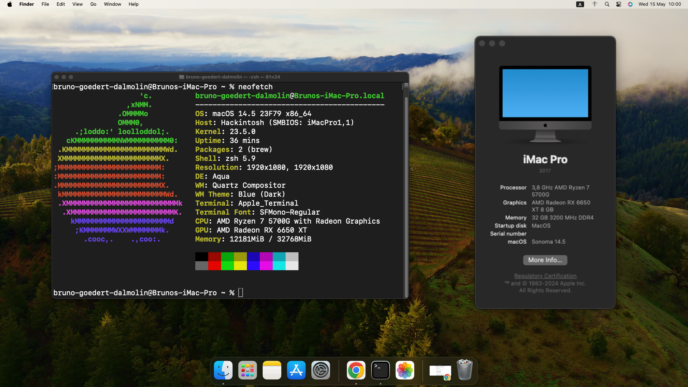
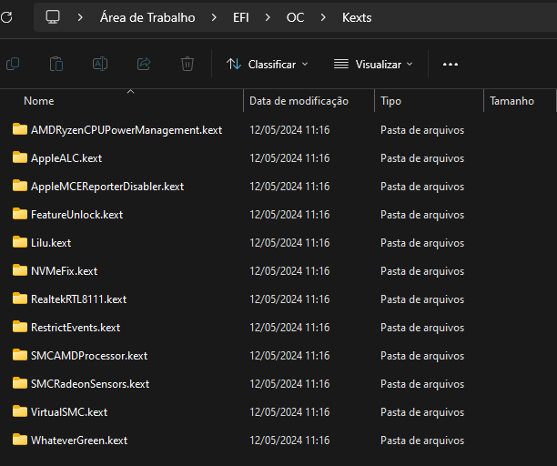
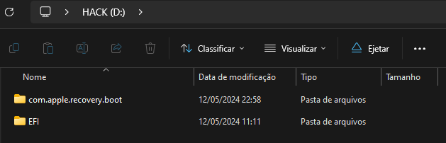

# Hackintosh Asus Tuf X570-PLUS/BR + Ryzen 7 5700G + RX 6650 XT

<h1 align="center">

</h1>

# Conteúdo deste repositório

| Recursos                       | Status    |
|--------------------------------|-----------|
| EFI pronta para download       | &#9745;   |
| Guia para criar essa EFI       | &#9745;   |

# Resumo:

  
| Componente       | Versão                                     |
|------------------|--------------------------------------------|
| MacOS            | 14.4.1 (Sonoma)                            |
| OpenCorePkg      | [1.0.0](https://github.com/acidanthera/OpenCorePkg/releases/tag/1.0.0) |
| Motherboard      | Asus TUF Gaming X570-Plus/BR               |
| Bios             | [5013](https://www.asus.com/br/motherboards-components/motherboards/tuf-gaming/tuf-gaming-x570-plus-br/helpdesk_bios?model2Name=TUF-GAMING-X570-PLUS-BR) (2024/04/04)                                       |
| CPU              | AMD Ryzen 7 5700G                          |
| GPU              | AMD Radeon RX 6650 XT                      |

# Guia para criar essa EFI

A partir de agora será demonstrado todo passo a passo que realizei para construir essa EFI.

# Obter as especificações do computador

Separe componente por componente, cada hardware tem sua propria configuração.

Recomendo utilizar o software Aida64 Extreme.

No meu caso:

| Componente       | Modelo                                | Especificação                                                                              |
|------------------|---------------------------------------|--------------------------------------------------------------------------------------------|
| Motherboard      | Asus TUF Gaming X570-Plus/BR         | 3 PCI-E x1, 2 PCI-E x16, 2 M.2, 4 DDR4 DIMM, Audio, Video, Gigabit LAN                     |
| CPU              | AMD Ryzen 7 5700G                    | OctalCore 4519 MHz (45.75 x 99)                                                           |
| GPU              | AMD Radeon RX 6650 XT                | Navi 23 - 8176 MB                                                                          |
| Memory Ram       | 4x Asgard 8 GB DDR4-3200            | VMA45UG-MEC1U2AW2 SDRAM (18-22-22-42 @ 1600 MHz) (16-20-20-38 @ 1422 MHz)                 |
| Disk Drive | CUSO CSN 500 NVMe M.2                | M.2/80 - 465 GB                                                                            |
| Audio Adapter    | Realtek S1200A                       |                                                                                            |
| Network Adapter  | Realtek® L8200A (LAN Turbo LAN Utility) | Realtek Gaming GbE Familly Controller                                                                                         |

# Atualizar a BIOS:

É extremamente recomendado que atualize a bios, uma vez que sempre é liberado novas atualizações com correções de erros e proteções aos componentes.

Baixe a bios no site oficial da Asus - [Download Here](https://www.asus.com/br/motherboards-components/motherboards/tuf-gaming/tuf-gaming-x570-plus-br/helpdesk_bios?model2Name=TUF-GAMING-X570-PLUS-BR).

No meu caso eu atualizei a Bios para a versão 5013 (2024/04/04).

# Configurar Parametros da BIOS:

Recomendo resetar as configurações da Bios e seguir este passo a passo.

Open Bios >> Default Option or Press F5.

Restart PC.

# Disable Bios Config
- Advanced Mode (F7) >> Boot >> Fast Boot = Disabled.
- Advanced Mode (F7) >> Boot >> Secure Boot >> OS Type = Other OS (This disable secure boot).
- Advanced Mode (F7) >> Advanced >> PCI Subsystem Settings >> Resize Bar Suport = Disabled.
- Advanced Mode (F7) >> Advanced >> Onboard Devices Configuration >> Serial Port Configuration >> Serial Port = Disabled.
- Advanced Mode (F7) >> Boot >> CSM (Compatibillity Support Module) >> Launch CSM = Disabled.

# Enable Bios Config
- Advanced Mode (F7) >> Advanced >> PCI Subsystem Settings >> Above 4G Decoding = Enabled.
- Advanced Mode (F7) >> Advanced >>  USB Configuration >> XHCI Hand-Off = Enabled.
- Advanced Mode (F7) >> Advanced >> SATA Configuration >> Sata Mode = AHCI.

(Optional to Force Memory Ram use 3200MHz)
- Advanced Mode (F7) >> Ai Tweaker >> Ai Overclock Tuner = D.O.C.P.
- Advanced Mode (F7) >> Ai Tweaker >> D.O.C.P. = DDR4-3200.

Save Changes & Exit (F10).

# Ferramentas Necessarias

- [Python 3.12.3](https://www.python.org/downloads/) (Obs: Add Python to Path)
- [ProperTree 0.2.9](https://github.com/corpnewt/ProperTree)
- [GenSMBIOS](https://github.com/corpnewt/GenSMBIOS)
- [iASL Compiler Windows Binary Tools](https://www.intel.com/content/www/us/en/developer/topic-technology/open/acpica/download.html).

# Kexts Necessarias (Release Only)
Baixe as Seguintes Kexts:

| Nome                                    | Versão | Descrição                                                                                                                                                                                  |
|-----------------------------------------|--------|--------------------------------------------------------------------------------------------------------------------------------------------------------------------------------------------|
| [AMD Ryzen CPU Power Management](https://github.com/trulyspinach/SMCAMDProcessor/releases)          | 0.7.2  | Para o AMD Power Gadget.                                                                                                                                                                   |
| [SMC AMD Processor](https://github.com/trulyspinach/SMCAMDProcessor/releases)                      | 0.7.2  | Para o AMD Power Gadget.                                                                                                                                                                   |
| [Apple MCE Reporter Disabler](https://github.com/acidanthera/bugtracker/files/3703498/AppleMCEReporterDisabler.kext.zip)            | 1.2.0  | Useful starting with Catalina to disable the AppleMCEReporter kext which will cause kernel panics on AMD CPUs and dual-socket systems.                                                     |
| [Lilu](https://github.com/acidanthera/Lilu/releases)                                    | 1.6.7  | Para corrigir diversos processos e atua em paralelo com VirtualSMC WhateverGreen.                                                                                                                |
| [VirtualSMC](https://github.com/acidanthera/VirtualSMC/releases)                              | 1.3.2  | Emulates the SMC chip found on real macs, without this macOS will not boot. Alternative is FakeSMC which can have better or worse support, most commonly used on legacy hardware. |
| [WhateverGreen](https://github.com/acidanthera/WhateverGreen/releases)                           | 1.6.6  | Used for graphics patching, DRM fixes, board ID checks, framebuffer fixes, etc; all GPUs benefit from this kext.                                                                          |
| [Apple ALC](https://github.com/acidanthera/AppleALC/releases/tag/1.9.0)                               | 1.9.0  | Para funcionar o som do dispositivo.                                                                                                                                                      |
| [RTL8111_driver_for_OS_X](https://github.com/Mieze/RTL8111_driver_for_OS_X/releases)                | 2.4.2  | Para corrigir erros da placa de rede e internet.                                                                                                                                          |
| [NVMe Fix](https://github.com/acidanthera/NVMeFix/releases)                               | 1.1.1  | Para corrigir erros de gerenciamento de energia do ssd nvme.                                                                                                                              |
| [RestrictEvents](https://github.com/acidanthera/RestrictEvents/releases)                         | 1.1.3  | Para corrigir erros do processador.                                                                                                                                                       |
| [SMCRadeonSensors](https://github.com/ChefKissInc/SMCRadeonSensors/releases)                       | 2.0.0  | Para corrigir obter dados da temperatura da placa de video.                                                                                                                               |
| [FeatureUnlock](https://github.com/acidanthera/FeatureUnlock/releases)                            | 1.1.5  | Para desbloquear conteudos como Sidecar, NightShift, AirPlay, Universal Control and Continuity Camera support dentro do MacOS.                                                             |
# Open Core Pkg

Faça download da versão release 1.0.0 do [OpenCore](https://github.com/acidanthera/OpenCorePkg/releases/tag/1.0.0).

Copiando a pasta base do OpenCore

- Extraia o arquivo: OpenCore-1.0.0-RELEASE.
- Acesse: "OpenCore-1.0.0-RELEASE\X64".
- Copie a pasta "EFI" e cole em outro lugar.

Copiando o config.plist base:

- Acesse: "OpenCore-1.0.0-RELEASE\Docs".
- Copie o arquivo: Sample.plist.
- Acesse a pasta "EFI" que salvamos anteriormente.
- Acesse: "/OC/".
- Cole o arquivo e renomeie para "config.plist".

Colocando as Kexts necessarias dentro da EFI:

- Copie todas as kexts que baixamos e extraimos anteriormente.
- Acesse dentro da nossa EFI: "EFI\OC\Kexts".
- Cole todas as kexts lá dentro.

No final você tera o seguinte resultado:

# Gerando o dump das ACPIs do seu computador

- Acesse a pasta iasl que baixamos anteriormente la nas ferramentas.
- Abra o terminal nesse diretório como administrador.
- Execute o seguinte comando: "acpidump.exe -b -n DSDT -z"
- Note que no mesmo diretório foi gerado o arquivo "dsdt.dat".
- Renomeie esse arquivo para: "Asus-X570-Tuf-5013.aml".
- Copie e cole esse arquivo dentro da nossa EFI no caminho: "EFI\OC\ACPI".

# Atualizando a EFI com as novas Kexts/ACPI

- Abra o ProperTree: "ProperTree-master\ProperTree.bat".
- Acesse: File > Open > Selecione o config.plist dentro de "EFI\OC\config.plist".
- Busque por SecureBootModel e mude para Disabled.
- Busque por XhciPortLimit e mude para true.
- Busque por SetupVirtualMap e mude para false.
- Busque por ProvideCurrentCpuInfo e mude para true.

# Mapeando os cores do processador

Este processo é exclusivo para maquinas com amd.

Acesse a pagina dos patchs para mapear os [cores](https://github.com/AMD-OSX/AMD_Vanilla).

Baixe apenas o arquivo [patches.plist](https://github.com/AMD-OSX/AMD_Vanilla/blob/master/patches.plist).

Abra esse arquivo baixado com o ProperTree.
Copie todos os filhos encontrados no "Patch" dentro de "Kernel".
Cole dentro de sua EFI no arquivo config.plist no mesmo caminho anterior "Patch" e "Kernel".

Após isso encontre os 4 filhos de "Patch" com o comentario algrey - Force cpuid_cores_per_package.

E substitua o valor do campo Replace para o indicado na [documentação](https://github.com/AMD-OSX/AMD_Vanilla?tab=readme-ov-file#read-me-first) conforme seu processador.

Lembre de salvar apos alterar cada registro.

# Adicionando suporte a GPU

- Abra o arquivo "config.plist" da sua EFI com o ProperTree.
- Acesse: Root > NVRAM > Add > (Key com final "...9F82) >> boot-args
- Insira agdpmod=pikera.

O boot args deve ficar dessa forma: "-v keepsyms=1 agdpmod=pikera"

- Dentro do config.plist execute o File > OC Clean SnapShot.
- Salve e feche o arquivo.

# Removendo arquivos desnecessarios da EFI

Tools:

- Acesse a pasta Tools no caminho: "EFI\OC\Tools"
- Apague todos os .efi.

Drivers:

- Acesse a pastas Drivers no caminho: "EFI\OC\Drivers"

Apague todos os arquivos exceto:

- AudioDxe.efi
- OpenCanopy.efi
- OpenRuntime.efi
- ResetNvramEntry.efi

Baixe o [HfsPlus.efi](https://github.com/acidanthera/OcBinaryData/blob/master/Drivers/HfsPlus.efi) e coloque nessa pasta.

Acesse e baixe o seguinte [repositório](https://github.com/acidanthera/OcBinaryData/tree/master).

- Abra a pasta Resources baixada.
- Copie Todas as pastas exceto audio.
- Substituas as mesmas dentro de sua EFI.

Abra o ProperTree:

- Acesse: File > Open > Selecione o config.plist dentro de "EFI\OC\config.plist".
- Alterar o Misc > Boot > Picker Mode > External.
- Alterar o Misc > Security > Valut > Optional.
- Alterar o Misc > Boot > HideAuxiliary > False.
- Alterar o Misc > Boot > PollAppleHotKeys > True;
- Dentro do config.plist execute o File > OC Clean SnapShot.
- Salve e feche o arquivo. 

# SSDT Time

Abra o SSDT Time.
- Insira a letra: P (Dump DSDT) e pressione Enter.
- Insira o numero: 1 (Fix HPET) e pressione Enter até voltar ao menu novamente.
- Insira o numero: 2 (Fake EC) e pressione Enter até voltar ao menu novamente.
- Insira o numero: 4 (USB X) e pressione Enter até voltar ao menu novamente.
- Insira o numero: 5 (Plugin Type) e pressione Enter até voltar ao menu novamente.
- Insira o numero: 7 (RTCAWAC) e pressione Enter até voltar ao menu novamente.
- Insira o numero: 8 (USB Reset) e pressione Enter até voltar ao menu novamente.

Por fim:
- Insira a letra: q (Quit) e pressione Enter para sair.

Acesse a pasta "Results" no caminho "SSDTTime-master\Results":
- Copie todos os arquivos com o final ".aml";
- Cole os arquivos dentro da sua EFI no caminho: "EFI\OC\ACPI";

Novamente dentro da pasta "Results" no caminho "SSDTTime-master\Results":
- Abra o arquivo "patches_OC.plist" com o ProperTree.
- Copie as tags Patch e Delete (Caso existir) para o seu config.plist no mesmo lugar.
- Dentro do config.plist execute o File > OC Clean SnapShot.
- Salve e feche o arquivo.

# GenSMBios

- Abra o GenSMBios.
- Insira o numero: 2 (Select config.plist) e pressione enter.
- Arraste o seu arquivo config.plist para dentro da janela do terminal.
- Pressione Enter.
- Insira o numero: 3 (Generate SMBIOS) e pressione enter.
- Insira o seguinte texto: iMacPro1,1
- Pressione Enter

Por fim:
- Insira a letra: q (Quit) e pressione Enter para sair.

# Verificando se o config.plist está correto
- Acesse o seguinte caminho da release baixada do open core: "OpenCore-1.0.0-RELEASE\Utilities\ocvalidate"
- Abra o terminal nesse diretório.
- Insira o seguinte comando: "ocvalidate "CAMINHO-CONFIG.PLIST""
- Substitua "CAMINHO-CONFIG.PLIST" pelo caminho do arquivo config.plist.

# Baixando a Imagem de Recovery do MacOS

Dentro da pasta do OpenCore que extraimos anteriormente existe uma ferramenta para isso.
- Portanto acesse o caminho: "OpenCore-1.0.0-RELEASE\Utilities\macrecovery";
- Abra o terminal nesse diretório.
- Execute o seguinte comando para baixar o sonoma: "python ./macrecovery.py -b Mac-A61BADE1FDAD7B05 -m 00000000000000000 download"

Obs: Caso queira outras versões obtenha o comando por meio do arquivo: "recovery_urls.txt".

# Gerando o Pendrive Bootavel

- Copie sua EFI na qual configurou anteriormente para dentro do Pendrive desejado.
- Copie a pasta "com.apple.recovery.boot" contendo a imagem do mac recovery.
- Cole a pasta copiada no diretorio do seu Pendrive.

Seu pendrive por fim deve conter o seguinte:

Agora apenas reinicialize sua maquina, e escolha no boot menu seu pendrive.
A partir do MacRecovery escolha um disco e realize a instalação do macos.

# Após instalar o MacOS
A partir de agora será instalado diversas ferramentas não oficiais da apple.
Caso deseje remover a mensagem de aviso ao instalar software não gerenciados pela AppleStore:

- Abra o terminal.
- Execute o seguinte comando: "sudo spctl --master-disable"

# Instalando as Ferramentas dentro do MacOS

- [Hackintool](https://github.com/benbaker76/Hackintool/releases/tag/4.0.3)
- [Python](https://www.python.org/) 
- [ProperTree](https://github.com/corpnewt/ProperTree)
- [MaciASL](https://github.com/acidanthera/MaciASL/releases/tag/1.6.4)
- [GfxUtil](https://github.com/acidanthera/gfxutil/releases)

# Realizando o FakeId da GPU não suportada

- Faça o download da [SSDT-BRG0.aml](https://github.com/luchina-gabriel/youtube-files/blob/main/Fake-GPUID.zip)
- Abra o GFX Util, encontre a linha no qual consta “GFX0”

No meu caso:
03:00.0 1002:73ef /PCI0@0/GPP0@1,1/VGA@0/LCD@0/GFX0@0 = PciRoot(0x0)/Pci(0x1,0x1)/Pci(0x0,0x0)/Pci(0x0,0x0)/Pci(0x0,0x0)

- Abra o arquivo SSDT-BRG0.aml no caminho “Fake-GPUID/SSDT-BRG0.aml”
- Subistitua as devidas linhas colocando o novo endereço coletado no GFX0

Arquivo original:
- External (_SB_.PCI0.PEG1.PEGP, DeviceObj)

Depois de alterado:
- External (_SB_.PCI0.GPP0.VGA.LCD, DeviceObj)

Obs: Altere tanto na linha do “External” como na linha do “Scope”.

- Após isso aperte em Compile.
- Depois acesse em File >> Save.

Caso voce abra o arquivo "SSDT-BRG0.aml" com o MaciASL novamente você vai ver que ele colocou underlines na linha "External" oque é considerado normal.

- Copie o Arquivo SSDT-BRG0.aml que editou para dentro do caminho da sua EFI: "EFI\OC\ACPI".

- Dentro do GFX Util na linha GFX0 copie tudo oque esta posterior ao
igual. No Meu caso:

PciRoot(0x0)/Pci(0x1,0x1)/Pci(0x0,0x0)/Pci(0x0,0x0)/Pci(0x0,0x0)

- Acesse o arquivo config.plist da pasta fake-gpuid
- Altere a chave PCI Path to RX 6650 XT para a linha copiada.

Dentro do seu config.plist da sua EFI:
- No boot-args também adicione: -radcodec.
- Copie a chave que alterou no config.plist da pasta fake-gpuid para seu config.plist.

- Salve as Alterações.
- Dentro do config.plist execute o File > OC Clean SnapShot.
- Salve e feche o arquivo.

# Renomeando o Processador

- Baixe o [CPU-Name](https://github.com/corpnewt/CPU-Name) corpnewt.
- Abra o CPU-Name.command.
- Informe o numero: 4 (Select PList).
- Arraste seu config.plist da sua EFI para dentro do terminal e pressione enter.
- Informe o numero: 1 (Change CPU Name).
- Informe o numero: 2 (Set to 0x0F01 for 8+ Core).
- Informe o seguinte nome: AMD Ryzen 7 5700G
- Pressione Enter.
- Informe a letra: q
- Pressione Enter.

# Permitindo navegar entre MacOS e Windows de outro disco 

Abra o config.plist da sua EFI.

- Acesse: Root > Misc > Security
- Altere o ScanPolicy para 0.
- Acesse: Root > Misc > Boot
- Altere o TimeOut para 10.
- Salve as Alterações.
- Dentro do config.plist execute o File > OC Clean SnapShot.
- Salve e feche o arquivo.

# Ajustando o Wake Up do Sleep ACPI
- Acesse a [documentação](https://dortania.github.io/OpenCore-Post-Install/usb/misc/instant-wake.html).
- Baixe o [SSDT-GPRW.aml](https://github.com/dortania/OpenCore-Post-Install/blob/master/extra-files/SSDT-GPRW.aml).
- Baixe o [GPRW-Patch.plist](https://github.com/dortania/OpenCore-Post-Install/blob/master/extra-files/GPRW-Patch.plist).
- Salve o SSDT-GPRW.aml Dentro da pasta ACPI da sua EFI.
- Abra o arquivo GPRW-Patch.plist e delete o final 02 da Chave Find e Replace.
- Copie o Patch 0 e salve no patch do seu config.plist da sua EFI.
- Dentro do config.plist execute o File > OC Clean SnapShot.
- Salve e feche o arquivo.

# Aplicando o Patch SMBUS

- Baixo o arquivo [SSDT-SBUS-MCHC.dsl](https://github.com/acidanthera/OpenCorePkg/blob/master/Docs/AcpiSamples/Source/SSDT-SBUS-MCHC.dsl).
- Substitua dentro do arquivo o "SBUS" pelo seu device path adequado.

Obs para obter o device path abra o hackintool e pegue por lá.

- Salve como ACPI.
- Coloque o arquivo gerado dentro da past ACPI da sua EFI.
- Dentro do config.plist execute o File > OC Clean SnapShot.
- Salve e feche o arquivo.

# Protegendo a EFI de possivel alterações oriundas do Windows

- Acesse seu config.plist.
- Acesse: Root > Miusc > Boot > Laucher Option > altere para: Full
- Salve e feche o arquivo.

# Ajustando o Disco do MacOS de Externo Para Interno

- Abra o Hackintool >> Acesse o menu PCIe.
- Ordene a listagem por Class.

Para cada registro contendo Class = Mass storage controller faça o seguinte processo:
- Clique com o direito sobre o registro > Copy Device Path.
- Abra seu config.plist de sua EFI.
- Acesse: Root > DeviceProperties > Add.
- Clique com o direito sobre Add > Selecione: New child under Add.
- Mude o Type desse registro criado para Dictionary.
- Cole o Device Path que você copiou no chave criada.
- Novamente clique com o direito sobre o registro criado > Selecione: New child under Add.
- Na chave informe: built-in
- Mude o Type para Data.
- No value coloque: 01000000.
- Crie uma chave do type String com a key = # comment: NVME

- Salve e feche o arquivo.

# Ajustando Som

- Abra seu config.plist da sua EFI.
- Acesse: Root > DeviceProperties > Add.
- Crie um novo dictionary e coloque o Device Path como nome desse campo.

No meu caso: PciRoot(0x0)/Pci(0x8,0x1)/Pci(0x0,0x6)

- Crie um novo filho para esse campo.
- Coloque a Key = layout-id
- Coloque o Type = Number

Busque neste [repositório](https://github.com/acidanthera/AppleALC/wiki/Supported-codecs) o layout adequado ao seu hardware.
No meu caso é um Realtek S1200A.
Buscando por S1200A encontrei o Realtek	ALCS1200A.

Onde temos os seguintes layouts:
layout 1, 2, 3, 7, 11, 49, 50, 51, 52, 69

O ideal é que você teste até funcionar.

- Portanto escolha um e coloque como Value da Key layout-id.

Agora crie outro filho para o  PciRoot(0...
- Coloque a Key = # comment: Audio
- Type String

# Ajustando Som ao ligar MacOS

- Abra o Hackintool >> PCIe.
- Ordene a listagem por Subclass.
- Busque por Audio device.

Encontre o registro com:
- Class = Multimedia controller
- SubClass = Audio Device
- IOReg Name deve conter /HDEF

Por fim:
- Pressione o botão direito do mouse > Copy Device Path.
- Acesse seu config.plist da sua EFI.
- Root > UEFI > Audio > AudioDevice > Cole no Valor oque foi copiado.

No meu caso: PciRoot(0x0)/Pci(0x8,0x1)/Pci(0x0,0x6)

- Root > UEFI > Audio > AudioOutMask > Altere para -1.
- Root > UEFI > Audio > AudioSuport > Altere para True.

# Referencias:
- [OpenCore Official Guide](https://dortania.github.io/OpenCore-Install-Guide/prerequisites.html).
- Youtube Channel: [Universo Hackintosh](https://www.youtube.com/@UniversoHackintosh)
- Github Repository: [Guide to Install MacOS on Ryzen Setup](https://github.com/luchina-gabriel/BASE-EFI-AMD-RYZEN-THREADRIPPER-PUBLIC)
- Discord Server: [Universo Hackintosh](https://discord.com/invite/VYugKNbUqz)

  
